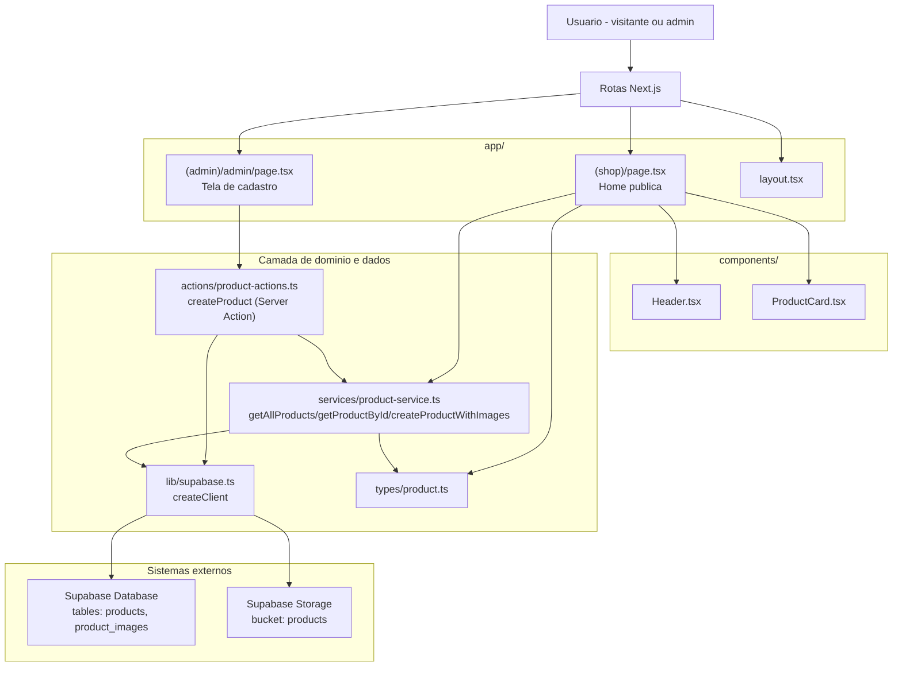
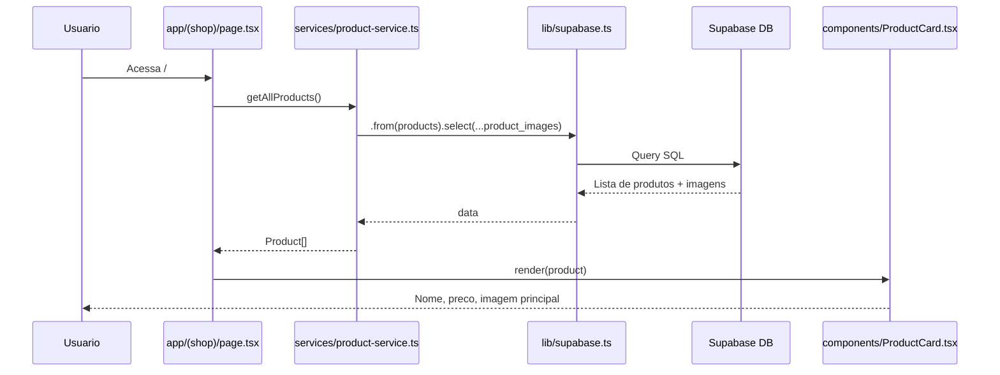
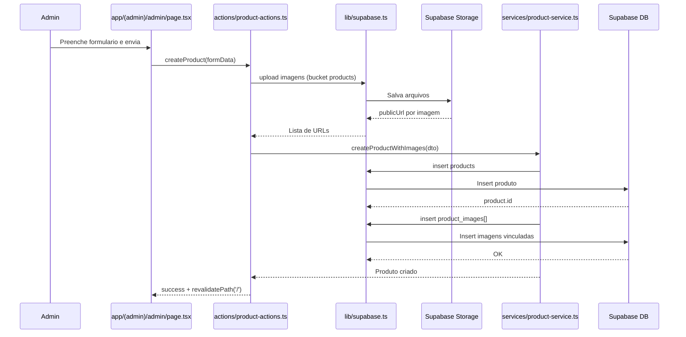

# Valence Manager

Aplicacao Next.js para vitrine de produtos com area administrativa para cadastro.

## Objetivo do produto

Entregar uma loja de visualizacao publica com:

- Visitante (sem login): listar produtos e ver detalhes com mais imagens.
- Admin (com login): criar e excluir produtos.

## Stack atual

- `Next.js 16`
- `React 19`
- `Supabase` (database + storage)

## Variaveis de ambiente

Criar `/.env.local` com:

```env
NEXT_PUBLIC_SUPABASE_URL=https://xgztkgddgjkxlkxlckmt.supabase.co
NEXT_PUBLIC_SUPABASE_ANON_KEY=SEU_ANON_KEY
```

Observacao: chave invalida gera erro `Invalid API key` ao buscar produtos.

## Execucao local (WSL)

```bash
cd ~/dev/personal/valence-manager
npm install
npm run dev
```

Aplicacao em `http://localhost:3000`.

## Estado atual do projeto

### Ja implementado

- Rota publica `/`:
  - lista produtos vindos do Supabase.
  - renderiza nome, preco e imagem principal.
- Rota `/admin`:
  - formulario de criacao de produto.
  - upload de multiplas imagens no bucket `products`.
  - persistencia em `products` e `product_images`.
- Estrutura de servico para listar e buscar produto por ID.

### Faltando para entrega do produto

1. **Autenticacao de admin**
   - Hoje qualquer pessoa pode acessar `/admin`.
   - Necessario login para admin e protecao de rota.

2. **Detalhe de produto para visitante**
   - Hoje o card mostra apenas listagem.
   - Necessario clicar no produto e abrir tela/modal com:
     - galeria de imagens
     - descricao
     - preco
     - disponibilidade

3. **Exclusao de produto por admin**
   - Criacao existe, exclusao nao.
   - Necessario remover:
     - registro em `product_images`
     - registro em `products`
     - arquivos do storage (bucket `products`)

4. **Controle de autorizacao nas actions**
   - `createProduct` precisa validar sessao/perfil admin no servidor.
   - `deleteProduct` (nova action) tambem deve validar admin.

## Escopo funcional de entrega (MVP)

### Usuario comum (sem login)

- Acessa `/` sem autenticacao.
- Visualiza lista de produtos.
- Clica em um produto e abre detalhes com mais imagens.

### Admin (com login)

- Faz login.
- Acessa `/admin`.
- Cadastra produto com multiplas imagens.
- Exclui produto existente.

## Criterios de aceite

### Publico

- Dado usuario nao autenticado, ao abrir `/` deve visualizar produtos sem erro.
- Dado clique em produto, deve abrir detalhes com todas as imagens ordenadas por `display_order`.

### Admin

- Dado usuario nao autenticado, ao abrir `/admin` deve ser redirecionado para login.
- Dado admin autenticado, deve conseguir criar produto com sucesso.
- Dado admin autenticado, deve conseguir excluir produto e suas imagens.
- Dado usuario comum, nao deve conseguir chamar actions administrativas.

## Plano de implementacao recomendado

### Fase 1 - Seguranca e acesso

- Implementar login de admin com Supabase Auth.
- Criar middleware para proteger `/admin`.
- Validar sessao admin dentro das server actions.

### Fase 2 - Experiencia do visitante

- Criar rota de detalhe `/(shop)/produto/[id]` ou modal client-side.
- Exibir carrossel/galeria com todas as imagens do produto.

### Fase 3 - Operacoes administrativas

- Criar action `deleteProduct`.
- Adicionar botao de excluir na listagem/admin.
- Garantir limpeza de dados no banco e no storage.

### Fase 4 - Qualidade para deploy

- Tratar estados de loading/erro e mensagens amigaveis.
- Revisar politicas de bucket e RLS no Supabase.
- Testar fluxos principais (manual + smoke test).

## Riscos atuais

- Falta de autenticacao em admin expone operacoes sensiveis.
- Falta de exclusao pode gerar acumulo de dados e arquivos orfaos.
- Chaves de ambiente incorretas quebram listagem inicial.

## Referencia Supabase

- Projeto: [Supabase Valence](https://supabase.com/dashboard/project/xgztkgddgjkxlkxlckmt)

## Diagrama da estrutura atual



## Diagrama de conversa entre arquivos

### Fluxo 1 - Listagem de produtos (`/`)



### Fluxo 2 - Cadastro de produto (`/admin`)

